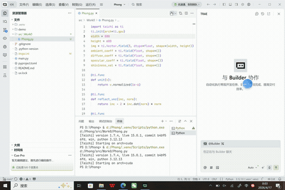

# Phong光照模型 效果展示

- 占博文 202411081043 人工智能
  
## 效果演果

## 一、项目简介
本项目为计算机图形学真实感渲染核心实验，基于 Python 手写实现经典 Phong 局部光照模型。不依赖高端图形渲染接口，通过纯数学公式模拟物体受光机制，分别计算环境光、漫反射、镜面高光三部分光照贡献，实现三维物体立体光影、明暗过渡、镜面反光效果，是三维真实感渲染、游戏光照、实时渲染的基础核心算法。
## 二、项目目录结构
Phong/
├── src/Work0/                # 核心实验源码目录
├── main.py                   # 程序入口、光照渲染主函数
├── Phong.gif                 # 项目效果演示动图
├── imgui.ini                 # 界面布局配置
├── .gitignore                # 忽略虚拟环境、缓存文件
├── .python-version           # Python 版本锁定
├── pyproject.toml            # 项目依赖配置
├── uv.lock                   # 依赖版本锁定文件
└── README.md                 # 项目说明文档
## 三、运行环境与依赖
- Python 版本：3.10+
- 环境说明：本地虚拟环境 .venv 已忽略，不提交仓库
- 依赖管理：支持 uv / pip 安装依赖
## 四、运行指令
项目根目录直接运行：
python main.py
## 五、核心算法原理
1. Phong光照模型概述
Phong 光照模型是计算机图形学中最经典的局部光照模型，模拟光线照射物体表面的光学现象。模型将物体最终颜色拆解为三部分叠加：环境光、漫反射光、镜面高光，可以高度还原物体的立体光影质感，广泛用于早期实时渲染、教学渲染、轻量化三维建模。
整体光照合成公式：
$$I_{final} = I_{ambient} + I_{diffuse} + I_{specular}$$
2. 环境光 Ambient
模拟场景全局散射光，无方向、无衰减，解决背光面完全漆黑的问题，保证画面整体柔和度。
$$I_a = k_a \cdot I_{light}$$
$$k_a$$ 为环境光反射系数，控制物体整体亮度。
3. 漫反射 Diffuse（物体立体明暗核心）
遵循朗伯光照定律，模拟粗糙物体表面对光线的均匀散射效果。光照强度与光线入射角度相关，正面最亮、侧面渐暗，形成物体基础立体感。
$$I_d = k_d \cdot I_{light} \cdot \max(\vec{n} \cdot \vec{l}, 0)$$
$$\vec{n}$$ 为表面法向量，$$\vec{l}$$ 为光线入射向量。夹角越小，接收光照越强。
4. 镜面高光 Specular（反光质感核心）
模拟光滑物体表面的镜面反射效果，视角与反射光线越接近，高光越亮，用于体现物体材质光滑度。
$$I_s = k_s \cdot I_{light} \cdot \max(\vec{r} \cdot \vec{v}, 0)^{shininess}$$
$$\vec{r}$$ 为光线反射向量，$$\vec{v}$$ 为视线向量，shininess 为高光幂次，数值越大高光越集中、越锐利。
5. 整体渲染流程
1. 计算模型表面每一点的法向量；
2. 归一化光线向量、视线向量、反射向量；
3. 分别计算环境光、漫反射、镜面高光分量；
4. 三分量叠加得到最终像素颜色；
5. 逐帧刷新，实现动态光照、视角旋转效果。
## 六、项目核心功能
- 完整实现标准 Phong 光照模型三分量光照计算
- 真实模拟物体明暗过渡、立体光影效果
- 可体现物体材质差异：粗糙/光滑材质高光区别
- 支持视角旋转、动态观察光照变化
- 纯数学算法实现，无渲染黑盒，原理完全透明
## 七、项目特点
- 原理透彻：完整复现图形学标准 Phong 光照公式，每一步光照可追溯
- 可视化直观：立体光影、高光效果明显，完美体现光照特性
- 教学价值高：是学习真实感渲染、材质、光照的必经核心实验
- 可拓展性强：可迭代为 Blinn-Phong、多光源、阴影、材质纹理光照
## 项目说明
- 项目核心代码存放于 src/ 目录
- 本地虚拟环境 .venv 已忽略
